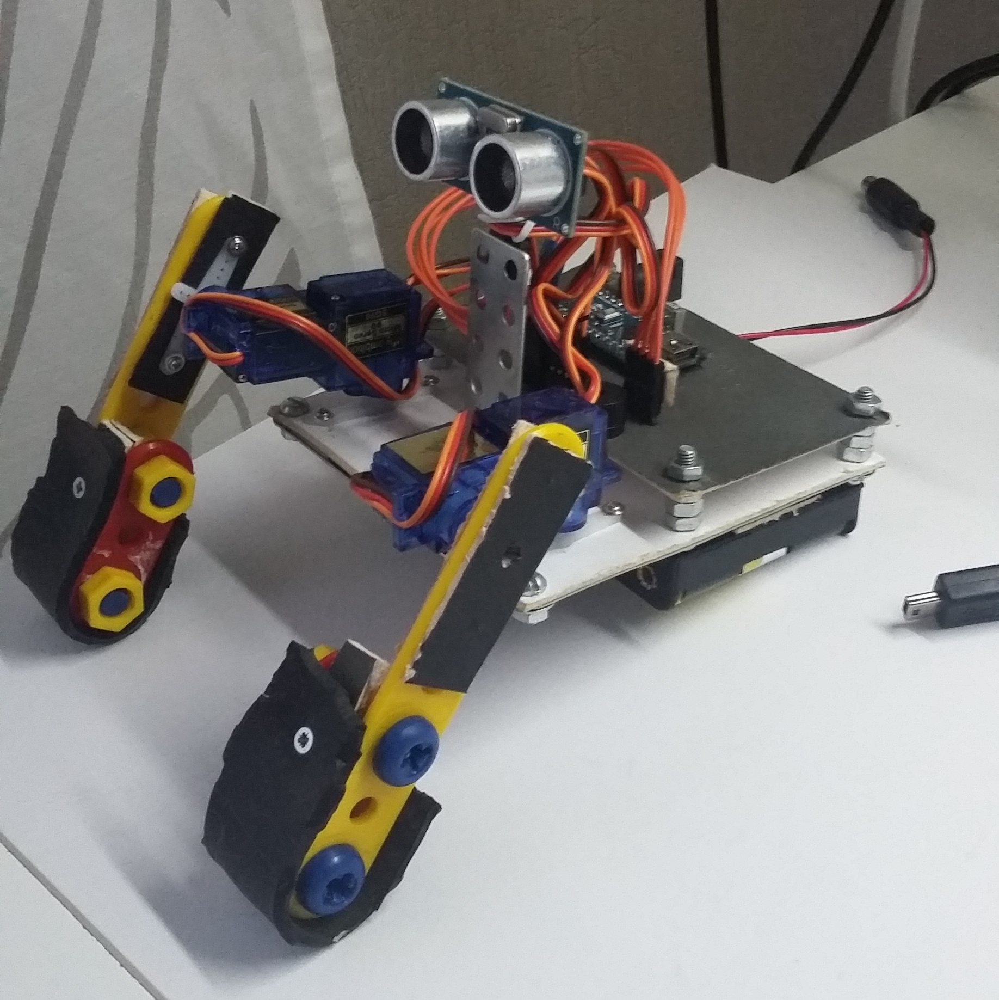

# Crêepe
My frist robot project.

## Goals of the project
- Learn how robots are made
- Make one robot

## Description
This robot is bipedal, but not as humans are, more like [mudskippers](
https://en.wikipedia.org/wiki/Mudskipper). Each leg (or arm, it is hard to
tell) has two servo in it: one used for horizontal positioning (*shoulder*),
one used for vertical positioning (*elbow*). Like bats, it can locate objects
using ultrasonic sensor, however this feature is not widely used. It has a
simple buzzer to make simple sounds.

The *brain* of this robot is fake Arduino Nano I bought somewhere in China. I
don't have a 3D printer, so I assembled it from good cardboard and metal toys
popular in Russia. It is powered by 6 AA batteries.

## Hardware parts
- 4 micro servos SG90 (I bought the cheapest, and I regret it)
- 1 ultrasonic sensor HC-SR04 (I bought the cheapest, works fine enough)
- 1 buzzer (use any)
- 1 IR receiver (I don't remember which one, but I do remember I accidentally
  broke 2 of them, so buy several just to be sure)
- 1 fake Arduino Nano (works fine)
- Lots of wires

And tools: solder iron, box cutter, etc. A wire stripper would be convenient,
but I didn't have one.

## Software part
The easiest way to upload a program to Arduino is official Arduino IDE, get it 
from repos of your OS or from official site. I used its CLI to upload programs,
while used `vim` to actually code. I binded upload and verify functions to some
nice keys.

